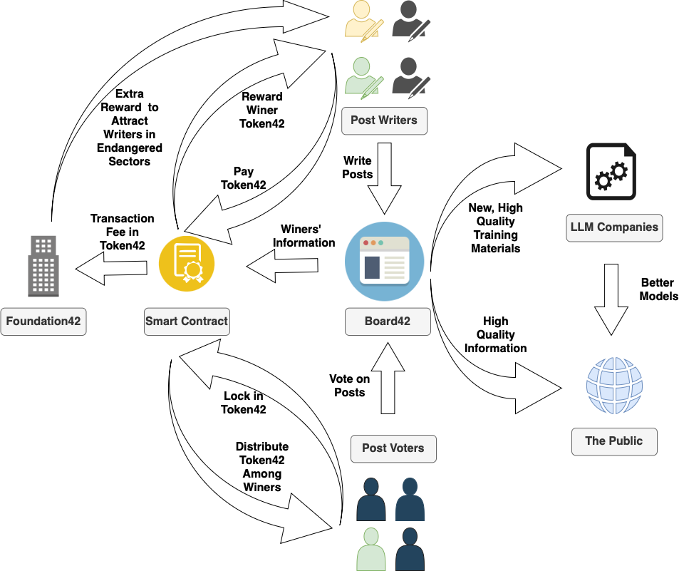

*Note: This is an ongoing project. If you are interested in learning more or contributing, please feel free to contact me.* 😊

## 1. This platform aims to address several key challenges:

* **Talent Discovery**: Enable the discovery of talented individuals through their contributions. 
* **Global Expertise Access**: Provide access to answers from experts around the world. 
* **LLM Training**: Consistently generate high-quality training materials for next-generation large language models (LLMs). 
* **Cultural Preservation**: Preserve endangered cultures and languages, while enhancing LLM performance on these cultures and languages. 
* **Stable Inflation**: Implement a sustainable inflation model with a 2% annual coin minting rate to maintain a consistent inflation expectation. 

## 2. How it works: 

**Token42** is an ERC-20 token that leverages smart contracts to automate core functionalities within the platform. **Board42** (the platform's website/app) allows users to post content across various categories and languages. To prevent abuse, each post requires a small fee of **0.1 Token42**. 

Users can vote by locking in **1 Token42 per vote**. Every month, the top three most-voted posts within each category and language are selected. The rewards are distributed as follows: 

* **Post Writers**: The authors of the winning posts will be rewarded with **newly minted Token42**, which ensures that content creators are incentivized to produce high-quality content. 
* **Post Voters**: Voters who voted for the winning posts will share in the rewards.
The rewards are funded by the locked-in tokens, and are distributed **proportionally** based on how much a voter locked in for the winning post, after a **5% platform fee** is deducted. [cite: 14] This means that the more tokens a voter locks in, the larger their share of the reward. 

All posts on Board42 will be freely accessible and can be used to generate **high-quality materials for training the next generation of LLMs**, with the condition that any LLM trained using these posts must be **open-sourced** after 3 years. 

**Foundation42** will oversee the day-to-day operations of the platform, including: 

* Setting post fees. 

* Adjusting reward ratios for the top 3 posts. 

* Managing the reserve of Token42. 

* Deciding which categories should be listed on Board42. 

* Offering additional incentives for content from **underrepresented categories**, for example, endangered cultures and languages, to improve LLM performance on these categories. 

The foundation will play a key role in ensuring the platform's sustainability and the preservation of cultural diversity. 

## 3. Potential Investor Interest and Social Impact: 

(1) Incentive Compatibility

This platform creates value for various stakeholders: 
* **Post Writers**: Writers can earn Token42 through winning posts and engage with experts in the field by asking questions and receiving answers. 
* **Post Voters**: Voters help curate the best content and earn rewards based on their participation.
* **AI Companies**: AI companies can obtain high-quality training data under the agreement that their models and weights will be open-sourced in 3 years, which helps the wider AI community. 
* **The Public**: The public can freely access high-quality posts, contributing to the dissemination of knowledge and cultural preservation. Meanwhile, the public can also benefit from LLM models with better performance.

(2) Voting Manipulation Prevention

Voter with sufficient Token42 may conduct *last-minute manipulation*: manipulate the outcome of a vote by locking in a large number of tokens at the last minute, effectively hijacking the process. 
To prevent vote manipulation, the following strategies will be explored: 

* **Time-Weighted Staking**: Votes placed early in the voting period carry more weight than those placed toward the end, reducing the impact of last-minute vote manipulation. 
* **Reputation System**: Addresses that vote early and consistently vote for the best posts will gain higher trust scores, giving their votes more weight. 

Figure 1, Token42 Platform Stakeholders Interaction Map

